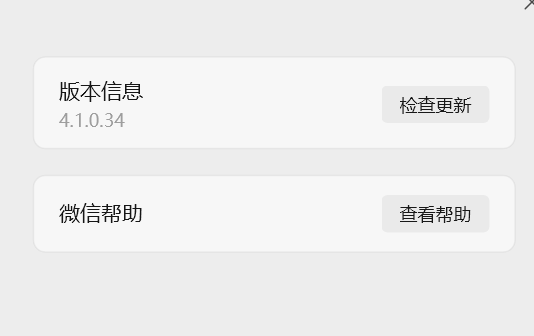

# WeChat Automation Bot (wxbot)

🤖 一个基于 pyautogui 和 win32gui 的双微信自动化机器人实现，支持个人微信和企业微信

> **免责声明**: 本项目仅用于学习和技术交流目的。请遵守微信使用条款，不要用于商业用途或违法行为。

## ✨ 功能特性

- 🔍 **智能进程识别** - 自动发现个人微信和企业微信主进程，区分主程序和小程序进程
- 🪟 **精确窗口定位** - 基于窗口句柄的稳定操作，支持多窗口管理
- 📨 **双微信支持** - 同时支持个人微信(WeChat/Weixin)和企业微信(WXWork)
- 🎯 **智能回退机制** - 个人微信不可用时自动切换企业微信发送
- 🛠️ **调试工具齐全** - 提供窗口检查器、进程选择器等调试工具
- 🔄 **完整自动化** - 支持定时任务和批量操作，智能选择最佳发送方式

## 🏗️ 项目结构

```
wxbot/
# 新架构 - 通用接口支持双微信
├── message_sender_interface.py   # 消息发送器通用接口定义
├── wechat_sender_v3.py           # 个人微信发送器(接口版)
├── wxwork_sender.py              # 企业微信发送器
├── auto_daily_report_v2.py       # 自动化系统v2.0 - 支持双微信智能切换

# 传统实现（向后兼容）
├── direct_sender.py              # 核心发送器 - 基于窗口句柄直接操作
├── window_inspector.py          # 窗口检查器 - 调试和窗口信息获取
├── auto_daily_report.py          # 自动化系统v1.0 - 仅支持个人微信
├── wechat_sender_v2.py           # 传统个人微信发送器
├── storage_system.py             # 存储统计系统
├── auto_report_config.json       # 配置文件 - 支持双微信配置
├── run_daily_auto.bat            # Windows批处理启动脚本
└── README.md                     # 项目文档
```

## 🚀 快速开始

### 环境要求

- Python 3.7+
- Windows 10/11
- 个人微信 PC 版 和/或 企业微信 PC 版

### 安装依赖

```bash
pip install pyautogui pyperclip pywin32 psutil
```

### 基本使用

#### 🆕 双微信自动化系统 (推荐)

```bash
# 查看发送器状态
python auto_daily_report_v2.py status

# 测试所有发送器
python auto_daily_report_v2.py test

# 执行完整自动化流程（智能选择微信）
python auto_daily_report_v2.py run
```

#### 单独测试发送器

```bash
# 测试个人微信
python wechat_sender_v3.py test
python wechat_sender_v3.py send [群名]

# 测试企业微信
python wxwork_sender.py test
python wxwork_sender.py send [群名]

# 手动选择企业微信窗口（调试用）
python wxwork_sender.py manual
```

#### 传统方式（向后兼容）

```bash
# 智能查找微信主进程和窗口
python window_inspector.py findwechat

# 发送测试消息
python direct_sender.py test <窗口句柄>

# 执行单微信自动化流程
python auto_daily_report.py run
```

## 📖 详细使用指南

### 🆕 双微信自动化系统 v2.0

基于统一接口的双微信支持，提供智能回退机制：

```python
from auto_daily_report_v2 import AutoReportSystemV2

system = AutoReportSystemV2()

# 初始化所有可用发送器
system.initialize_senders()

# 智能选择最佳发送器并发送
system.run_full_automation()
```

**核心特点：**
- 🤖 **智能发送器选择** - 根据配置优先级和可用性自动选择
- 🔄 **自动回退机制** - 个人微信不可用时自动切换企业微信
- ⚙️ **统一配置管理** - 单一配置文件管理所有发送器
- 🔍 **自动窗口识别** - 无需手动配置窗口句柄
- 📊 **详细状态报告** - 提供发送器状态和调试信息

### 企业微信发送器

专门针对企业微信(WXWork.exe)优化：

```python
from wxwork_sender import WXWorkSender

sender = WXWorkSender()

# 发送消息到企业微信群聊
success = sender.auto_send_daily_report("蓝光统计")
```

**特点：**
- ✅ 精确识别WeWorkWindow主窗口
- ✅ 强制激活和置顶窗口
- ✅ 智能输入框定位
- ✅ 支持手动窗口选择调试

### DirectSender - 传统发送器（向后兼容）

稳定的个人微信发送方案，直接使用窗口句柄操作：

```python
from direct_sender import DirectSender

sender = DirectSender()

# 发送消息到指定窗口
hwnd = 12345678  # 目标窗口句柄
message = "Hello, World!"
success = sender.send_message_to_window(hwnd, message)
```

**特点：**
- ✅ 无需配置坐标
- ✅ 自动点击输入框区域
- ✅ 多种发送方式备选
- ✅ 详细的执行日志

### WindowInspector - 窗口调试工具

用于获取窗口信息和调试：

```bash
# 交互式点击获取窗口信息（推荐）
python window_inspector.py click
# 然后将鼠标移到目标窗口，按 Ctrl+Alt+I 获取信息

# 智能查找微信进程
python window_inspector.py findwechat
```

### AutoDailyReport - 自动化系统

完整的自动化解决方案：

```python
from auto_daily_report import AutoReportSystem

system = AutoReportSystem()

# 添加目标群聊
system.add_group("技术交流群")

# 更新窗口句柄
system.update_target_windows()

# 发送自定义内容
# （需要先准备 report 文件或修改代码）
```

## ⚙️ 配置文件

### 🆕 v2.0 双微信配置 (推荐)

`auto_report_config.json` 新格式支持双微信：

```json
{
  "version": "2.0",
  "default_sender": "wechat",
  "sender_priority": ["wechat", "wxwork"],
  "fallback_enabled": true,
  
  "senders": {
    "wechat": {
      "type": "wechat",
      "enabled": true,
      "process_names": ["WeChat.exe", "Weixin.exe", "wechat.exe"],
      "default_group": "存储统计报告群",
      "target_groups": [
        {
          "name": "技术交流群",
          "hwnd": null,
          "enabled": true
        }
      ]
    },
    "wxwork": {
      "type": "wxwork", 
      "enabled": true,
      "process_names": ["WXWork.exe", "wxwork.exe"],
      "default_group": "蓝光统计",
      "target_groups": [
        {
          "name": "蓝光统计",
          "hwnd": null,
          "enabled": true
        }
      ]
    }
  },
  
  "message_settings": {
    "add_timestamp": true,
    "add_sender_info": true,
    "format_style": "emoji"
  }
}
```

**配置说明：**
- `default_sender`: 默认使用的发送器类型
- `sender_priority`: 发送器优先级顺序
- `fallback_enabled`: 启用回退机制（推荐）
- 支持自动配置迁移，旧配置会自动升级

## 🛠️ 进阶用法

### 自定义消息内容

修改 `direct_sender.py` 中的消息格式化函数：

```python
def format_custom_message(self, content):
    timestamp = datetime.now().strftime('%Y-%m-%d %H:%M:%S')
    
    formatted_content = f\"\"\"📢 自动消息
🕐 发送时间: {timestamp}

{content}

🤖 由 wxbot 自动发送\"\"\"
    
    return formatted_content
```

### 定时任务设置

#### Windows 任务计划程序

1. 打开"任务计划程序"
2. 创建基本任务
3. 设置触发器（每日、每周等）
4. 操作选择"启动程序"：`run_daily_auto.bat`

#### Python 定时器

```python
import schedule
import time

def send_daily_message():
    # 你的发送逻辑
    pass

# 每天上午 9 点执行
schedule.every().day.at(\"09:00\").do(send_daily_message)

while True:
    schedule.run_pending()
    time.sleep(60)
```

### 批量操作

```python
# 批量发送到多个群聊
target_windows = [12345678, 23456789, 34567890]
message = \"批量消息内容\"

sender = DirectSender()
for hwnd in target_windows:
    sender.send_message_to_window(hwnd, message)
    time.sleep(2)  # 避免发送过快
```

## 🔧 故障排除

### 常见问题

1. **找不到微信进程**
   - 确保微信已启动
   - 尝试以管理员权限运行
   - 检查进程名称（Weixin.exe 或 WeChat.exe）

2. **窗口句柄无效**
   - 窗口可能已关闭或最小化
   - 使用 `window_inspector.py` 重新获取句柄
   - 确保目标群聊/联系人窗口已打开

3. **消息发送失败**
   - 检查输入框是否获得焦点
   - 尝试不同的发送快捷键
   - 使用调试模式检查点击位置

4. **编码问题**
   - 确保 Python 文件使用 UTF-8 编码
   - Windows 控制台可能需要设置编码

### 调试模式

```bash
# 详细的窗口信息
python direct_sender.py info <窗口句柄>

# 测试点击位置（不发送消息）
python direct_sender.py click <窗口句柄>

# 获取调试信息
python auto_daily_report.py debug
```

## 📝 开发说明

### 核心原理

1. **进程识别**: 使用 `psutil` 查找微信进程，按内存使用量排序选择主进程
2. **窗口定位**: 通过 `win32gui` 枚举窗口，根据进程 ID 筛选目标窗口
3. **消息发送**: 使用 `pyautogui` 模拟键盘操作，通过剪贴板传递中文内容
4. **稳定性保证**: 多种发送方式备选，详细的错误处理和重试机制

### 扩展开发

如果需要扩展功能，建议的扩展点：

- **消息类型**: 支持图片、文件发送
- **群聊管理**: 自动加群、踢人等
- **消息监听**: 接收消息并自动回复
- **界面优化**: 添加 GUI 界面

### 贡献指南

欢迎提交 Issue 和 Pull Request！

1. Fork 本项目
2. 创建特性分支：`git checkout -b feature/新功能`
3. 提交更改：`git commit -am '添加新功能'`
4. 推送分支：`git push origin feature/新功能`
5. 提交 Pull Request

## 📋 TODO

- [x] ✅ 支持企业微信(WXWork)发送
- [x] ✅ 双微信智能回退机制
- [x] ✅ 统一发送器接口架构
- [x] ✅ 自动窗口识别和激活
- [ ] 支持图片和文件发送
- [ ] 添加消息接收监听功能
- [ ] 创建简单的 GUI 界面
- [ ] 支持钉钉、飞书等其他企业IM
- [ ] 支持 Linux 和 macOS
- [ ] 添加更多的微信版本适配
- [ ] 性能优化和内存使用改进

## ⚠️ 注意事项

1. **使用风险**: 自动化操作可能违反微信使用条款，存在封号风险
2. **版本兼容**: 本项目基于特定微信版本开发，新版本可能需要适配
   - 个人微信: 支持 WeChat.exe、Weixin.exe
   - 企业微信: 支持 WXWork.exe，基于 WeWorkWindow 窗口类
3. **系统权限**: 某些操作可能需要管理员权限
4. **网络环境**: 确保网络连接稳定，避免操作失败
5. **频率控制**: 避免高频操作，建议添加适当延迟
6. **双微信使用**: 
   - 智能回退机制确保至少有一种微信可用
   - 企业微信窗口识别可能因版本差异需要调试
   - 建议先使用手动选择模式确认窗口句柄

## 📄 许可证

本项目采用 MIT 许可证。详见 [LICENSE](LICENSE) 文件。

## 🤝 致谢

感谢以下开源项目的启发和支持：

- [pyautogui](https://github.com/asweigart/pyautogui) - 跨平台的 GUI 自动化库
- [pywin32](https://github.com/mhammond/pywin32) - Windows API 访问库
- [psutil](https://github.com/giampaolo/psutil) - 系统进程管理库

## 📞 联系方式

如有问题或建议，欢迎通过以下方式联系：

- 📧 邮箱: 364345866@qq.com
- 💬 微信: 364345866
- 🐙 GitHub: [jxyk2007](https://github.com/jxyk2007)

---

## 🆕 v2.0 更新亮点

### 双微信支持架构
- 🎯 **统一接口设计**: `MessageSenderInterface` 抽象基类
- 🔄 **智能回退机制**: 个人微信 ↔ 企业微信无缝切换  
- ⚙️ **配置自动迁移**: 旧配置自动升级到新格式
- 🪟 **精确窗口识别**: 支持 `WeWorkWindow` 企业微信主窗口

### 企业微信专项优化
- 🔍 **进程识别**: 智能识别 `WXWork.exe` 进程
- 🪟 **窗口激活**: 强制显示、置顶、恢复最小化窗口
- 📍 **输入框定位**: 基于窗口位置计算输入区域
- 🛠️ **调试工具**: 手动选择窗口、窗口信息展示

### 使用体验提升  
- 📊 **状态监控**: 实时显示发送器可用状态
- 🧪 **测试功能**: 一键测试所有发送器
- 📝 **详细日志**: 完整的操作和错误日志
- 🔧 **向后兼容**: 保持对旧版本的完全兼容




⭐ 如果这个项目对你有帮助，请给个 Star 支持一下！ 
